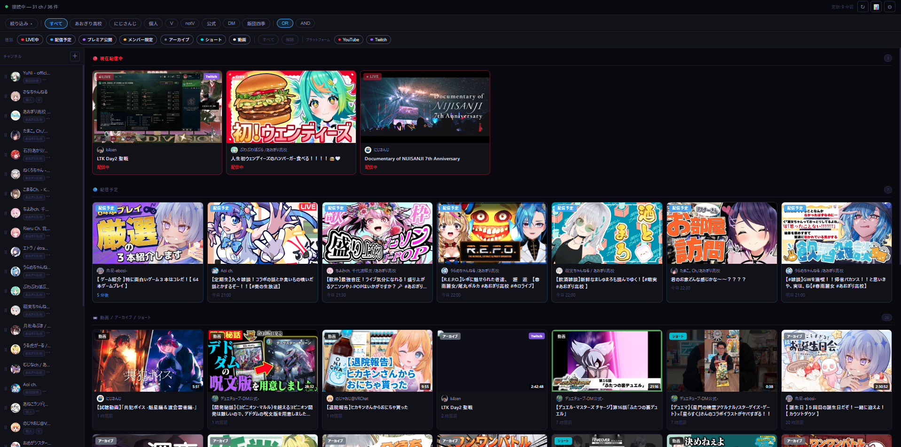
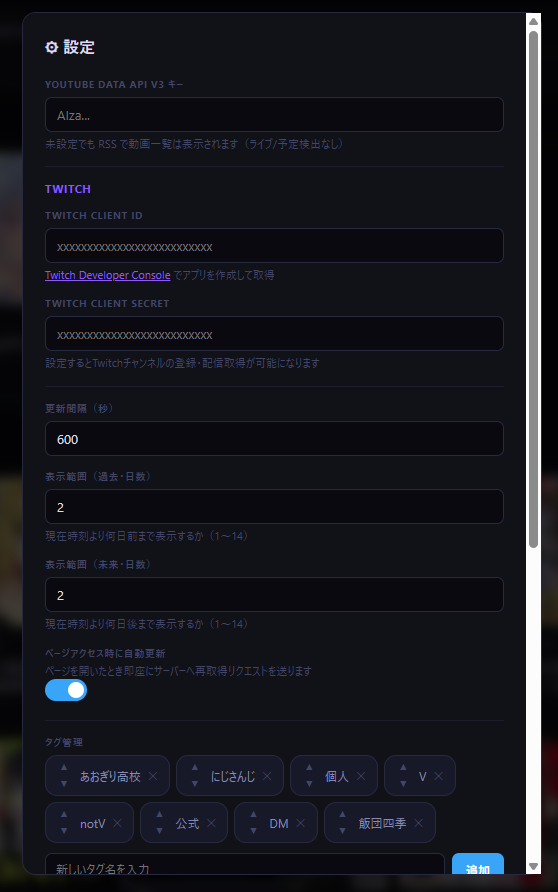
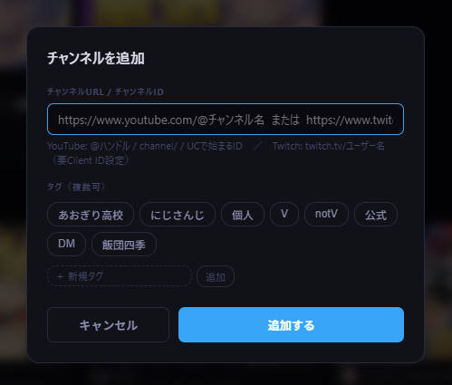
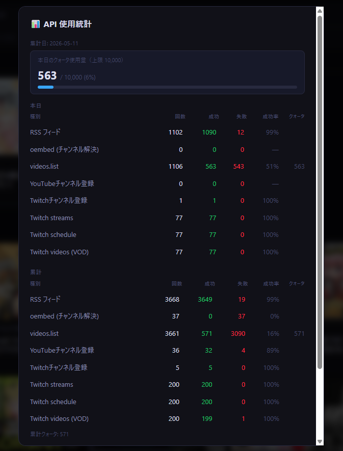

<div align="center">
  
  <h1>Livelist</h1>
  <p>YouTube + Twitch チャンネルの配信・動画を自動取得して一覧表示する<br>ローカルネットワーク向け Web アプリ</p>

  
  
  

  **🌐 [https://wrenchsun.github.io/livelist/](https://wrenchsun.github.io/livelist/)**
</div>

---

## ダウンロード

**[📦 Releases](../../releases/latest)** から `Livelist_vX.X.X.zip` をダウンロードしてください。

| ファイル | 説明 |
|---|---|
| `Livelist_vX.X.X.zip` | exe 版（Python インストール不要） |

解凍して `Livelist.exe` を起動するだけで使えます。

---

## スクリーンショット

> ※ 画像は開発中の画面です。実際の表示と一部異なる場合があります。


*メイン画面 — タグ・種別・プラットフォームでの絞り込み、サイドバーのチャンネル一覧*

| 設定 | チャンネル追加 |
|---|---|
|  |  |


*API 使用統計 — クォータ消費量・成功率をリアルタイムで確認*

---

## セットアップ

### 1. サーバーを起動する

| ファイル | 動作 | 用途 |
|---|---|---|
| `Livelist.exe` | コンソールウィンドウあり | 通常使用。ログを確認しながら運用したいとき |
| `LivelistBG.exe` | ウィンドウなし・バックグラウンド | 常駐させたいとき・スタートアップ登録用 |
| `start.bat` | `LivelistBG.exe` 優先、なければ `Livelist.exe`、なければ Python | 手動で再起動したいとき（既存プロセスを自動終了して再起動） |

起動後、ブラウザで以下にアクセスしてください。

```
http://localhost:8080
```

> 起動直後にページが空の場合は、しばらく待ってから ↻ ボタンを押すか F5 でリロードしてください。初回は API への問い合わせが完了するまで数秒〜数十秒かかります。

#### コンソールウィンドウについて（Livelist.exe）

起動時に黒いウィンドウ（コンソール）が開きます。サーバーの動作ログが表示され、**閉じるとサーバーも終了します。** 使用中は最小化して残してください。

#### バックグラウンドモード（LivelistBG.exe）

ウィンドウが一切表示されず、タスクバーにも現れません。タスクマネージャーのプロセス一覧に `LivelistBG.exe` として表示されます。停止するには `stop.bat` を実行するか、タスクマネージャーからプロセスを終了してください。

---

### 2. PC 起動時に自動起動する（スタートアップ登録）

Windows のタスクスケジューラーを使って、ログオン時に自動でバックグラウンド起動できます。

#### 登録

1. `register-startup.bat` をダブルクリック
2. 「完了」と表示されたら登録成功
3. 「今すぐ起動しますか？」に `y` を入力すると即座にバックグラウンド起動

`LivelistBG.exe` が存在する場合はそれを、なければ `Livelist.exe`、それもなければ Python で起動するよう自動判別して登録します。

#### 解除

`unregister-startup.bat` をダブルクリックすると自動起動が解除されます。実行中のサーバーは停止しません。

#### 確認

タスクスケジューラー（`taskschd.msc`）を開き、「タスクスケジューラーライブラリ」に `Livelist` が表示されていれば登録されています。

> **移動・リネーム後は再登録が必要:** フォルダを移動した場合、タスクスケジューラーに登録されたパスが古いままになります。`register-startup.bat` を再度実行して登録し直してください。

---

### 3. チャンネルを登録する

サイドバーの **＋** ボタンから URL を入力して追加します。

| プラットフォーム | 対応形式 | 例 |
|---|---|---|
| YouTube | @ハンドル URL | `https://www.youtube.com/@チャンネル名` |
| YouTube | channel/ URL | `https://www.youtube.com/channel/UCxxxxxx` |
| YouTube | チャンネル ID | `UCxxxxxx`（UC から始まる 24 文字） |
| Twitch | チャンネル URL | `https://www.twitch.tv/ユーザー名` |

> **サブチャンネルが登録できない場合:** YouTube のサブチャンネルはメインチャンネルと内部 ID が同一になることがあります。その場合「既に登録済み」として弾かれますが、**メインチャンネルより先にサブチャンネルを登録する**と解決する場合があります。

---

### 4. YouTube API キーを設定する（推奨）

未設定でも RSS で動画一覧は表示されますが、設定すると **LIVE・配信予定の正確な検出** が可能になります。

1. Google Cloud Console（`console.cloud.google.com`）でプロジェクトを作成
2. **YouTube Data API v3** を有効化
3. **API キー**を作成（制限: なし または IP アドレス）
4. ⚙設定 → **YouTube Data API v3 キー** に入力して保存

> **クォータ上限:** 1日 10,000 ユニット（`videos.list` 1ユニット/コール、1コールで最大50件処理）。  
> 📊 ボタンで使用量を確認できます。  
> **目安:** チャンネル数 30・24 時間稼働の場合、更新間隔 **900 秒（15 分）** がクォータ上限に収まる目安です。

---

### 5. Twitch を使う場合

#### 5-1. Twitch アプリを登録

1. Twitch Developer Console（`dev.twitch.tv/console`）に Twitch アカウントでログイン
2. **「アプリケーション」→「＋アプリケーションを登録」** をクリック
3. 以下を入力して「作成」
   - 名前: 任意（例: `Livelist`）
   - OAuth リダイレクト URL: `http://localhost`
   - カテゴリ: `Application Integration`

#### 5-2. Client ID と Client Secret を取得

1. 作成したアプリの **「管理」** をクリック
2. **Client ID** をコピー
3. **「新しいシークレット」** をクリックして **Client Secret** をコピー

> ⚠️ Client Secret はページを閉じると二度と表示されません。必ず保存してください。

#### 5-3. ⚙設定 に入力して保存

Twitch API はクォータ制限なし。アクセストークンは自動取得・自動更新されます。

---

## 画面の使い方

### タグフィルター

上部バーのタグボタンをクリックしてチャンネルを絞り込みます。複数選択可能です。タグに属さないチャンネルはサイドバーの「タグ外」セクションに薄く表示されます。

タグバーの右端に常時表示される **OR / AND** ボタンで絞り込みモードを切り替えられます。

- **OR（デフォルト）**: いずれかのタグを持つチャンネルを表示
- **AND**: 選択したタグをすべて持つチャンネルのみ表示

選択したモードはブラウザに保存されます。タグ絞り込みを変更すると、特定チャンネルへの絞り込み（個人モード）は自動的に解除されます。

### 種別絞り込み

「**絞り込み ▾**」ボタンをクリックするとパネルが開き、表示する種別を個別に ON/OFF できます。

| 種別 | 内容 |
|---|---|
| LIVE中 | 現在配信中 |
| 配信予定 | スケジュール済みの配信 |
| プレミア公開 | YouTube プレミア |
| メンバー限定 | タイトルにキーワードを含むコンテンツ |
| アーカイブ | 配信の録画・Twitch VOD |
| ショート | 180 秒以内の動画、またはタイトルにショートキーワードを含む動画（YouTube） |
| 動画 | 通常の動画 |

絞り込み中はステータスバーに **表示件数 / 総件数** が表示されます。選択状態はブラウザに保存されます。

### チャンネルフィルター

サイドバーのチャンネル名（またはアイコン）をクリックすると、そのチャンネルだけを表示します。もう一度クリックで解除。

### チャンネルの並び替え

サイドバーの ⠿ をドラッグして並び順を変更できます。

### その他のボタン

| ボタン | 機能 |
|---|---|
| ↻ | 手動で最新データを取得（キャッシュを破棄して再取得） |
| 📊 | API 使用量・成功率の統計を表示 |
| ⚙ | API キー・タグ・メンバー限定キーワード・ショートキーワードなどの設定 |

---

## ファイル構成

```
Livelist/
├── Livelist.exe              ← 通常起動（コンソールあり）
├── LivelistBG.exe            ← バックグラウンド起動（ウィンドウなし）
├── index.html                ← Web UI（ダブルクリックでブラウザ表示・改変用）
├── start.bat                 ← 手動再起動
├── register-startup.bat      ← スタートアップ登録
├── unregister-startup.bat    ← スタートアップ解除
├── config.json               ← 設定（APIキーなど）※gitignore 対象
│
├── asset/                    ← 自動生成データ（起動時に自動作成）※gitignore 対象
│   ├── channels.json
│   ├── cache.json
│   ├── tags.json
│   └── api_stats.json
│
├── source/                   ← 改変・ビルド用（exe のみ使う場合は不要）
│   ├── server.py             ← サーバー本体（Python で直接起動も可）
│   ├── build.bat             ← exe をビルドするスクリプト
│   ├── livelist.spec         ← PyInstaller 設定
│   └── icon.ico              ← exe アイコン（256/128/64/48/32/16px）
│
└── tests/                    ← 単体テスト（Python 3.12 + unittest）
    ├── test_classifier.py    ← ストリーム分類・shorts/member 判定
    └── test_url_parser.py    ← URL パターン・稼働時間ロジック
```

> **exe 版の動作:** `Livelist.exe` / `LivelistBG.exe` はどちらも `index.html` を内部に同梱しています。`config.json` はルートに、チャンネル・キャッシュ・タグなどのデータは `asset/` フォルダに自動で読み書きされます。`asset/` フォルダがなければ起動時に自動生成されます。

---

## config.json 設定項目

| キー | デフォルト | 説明 |
|---|---|---|
| `youtube_api_key` | `""` | YouTube Data API v3 キー |
| `twitch_client_id` | `""` | Twitch アプリの Client ID |
| `twitch_client_secret` | `""` | Twitch アプリの Client Secret |
| `port` | `8080` | サーバーポート番号 |
| `refresh_interval` | `600` | 自動更新間隔（秒） |
| `days_past` | `2` | 過去方向の表示範囲（日数）。現在時刻より何日前まで表示するか（1〜14） |
| `days_future` | `2` | 未来方向の表示範囲（日数）。現在時刻より何日後まで表示するか（1〜14） |
| `member_keywords` | 既定の 6 語 | メンバー限定判定キーワード（⚙設定から編集可） |
| `shorts_keywords` | 既定の 5 語 | ショート判定キーワード（⚙設定から編集可） |
| `operating_hours` | `{"enabled":false,"start":"08:00","end":"23:00"}` | 稼働時間設定。`enabled` を `true` にすると時間外の自動更新を停止。終了が開始より早い場合は深夜またぎ（例: 22:00〜02:00）。⚙設定から変更可。手動更新・ページアクセス時の更新は時間外でも常に有効 |

**member_keywords のデフォルト値:**  
`メン限` / `メンバー限定` / `メンバーシップ限定` / `member only` / `members only` / `メンバー専用`

**shorts_keywords のデフォルト値:**  
`#shorts` / `#short` / `#ショート` / `short` / `ショート`  
180 秒以内の動画も自動的にショートと判定されます。キーワード判定が優先されるため、180 秒を超える動画もキーワードがあればショートに分類されます。

---

## ローカルネットワークでの利用

サーバー起動時にコンソールに表示されるネットワークアドレス（例: `http://192.168.0.xxx:8080`）に、同じ LAN 内の別端末からアクセスできます。

> **ファイアウォールの許可:** 初回起動時に「このアプリのネットワークアクセスを許可しますか？」という Windows Defender ファイアウォールのダイアログが表示される場合があります。LAN 内からアクセスするには **「プライベートネットワーク」を許可** してください。

---

## サーバーについて

### 動作の仕組み

- Python 標準ライブラリの `ThreadingHTTPServer` をベースにしたシンプルな HTTP サーバーです
- バックグラウンドスレッドが `refresh_interval` 秒ごとに API・RSS を巡回し、`cache.json` に書き込みます
- ブラウザからのリクエストはキャッシュを返すだけなので、更新タイミングに関係なく即座にページが開きます
- HTTPS・認証機能はありません。**インターネットに直接公開しないでください。**

### ポート番号の変更

`config.json` の `"port"` を変更してサーバーを再起動すると、指定したポートで起動します。

```json
"port": 9090
```

変更後はブラウザのアクセス先も変更してください（例: `http://localhost:9090`）。スタートアップ登録済みの場合は再登録不要です。

### exe 版の注意事項

- **ウイルス対策ソフトの誤検知:** PyInstaller で生成した exe は、ウイルス対策ソフトに誤検知される場合があります。除外設定に追加するか、Python 版で運用してください
- **SmartScreen の警告:** 初回実行時に「Windows によって PC が保護されました」と表示される場合は、「詳細情報」→「実行」で起動できます
- **UI の更新:** exe 版は `index.html` を内部に同梱しているため、外部の `index.html` を編集しても反映されません。UI を変更した場合は `build.bat` で再ビルドしてください

---

## 技術情報（エンジニア向け）

### 技術スタック

| レイヤー | 技術 | 備考 |
|---|---|---|
| サーバー言語 | Python 3.12+ | 外部パッケージ不要（標準ライブラリのみ） |
| HTTP サーバー | `http.server.ThreadingHTTPServer` | マルチスレッド対応の標準実装 |
| HTTP クライアント | `urllib.request` | requests 等の外部ライブラリ不使用 |
| XML パース | `xml.etree.ElementTree` | YouTube RSS の解析に使用 |
| フロントエンド | Vanilla JS / HTML / CSS | フレームワーク・ビルドツール不使用、単一ファイル |
| データ保存 | JSON ファイル（ローカル） | DB 不使用。atomic replace（tmp → rename）で書き込み |
| パッケージング | PyInstaller 6.x | `index.html` を exe に同梱、`--onefile` ではなく `--onedir` |
| 型定義 | `TypedDict` / `NotRequired` / `Literal` | `StreamDict` / `ChannelDict` などで主要スキーマを型付け |
| テスト | Python `unittest`（標準ライブラリ） | `tests/` に 54 件。分類ロジック・URL パーサー・稼働時間を網羅 |

### 外部 API 呼び出しフロー

```
refresh_loop（refresh_interval 秒ごと、稼働時間内のみ）
  │
  ├─ [YouTube チャンネルごと]
  │    ├─ YouTube RSS フィード          … クォータ消費なし
  │    │    └─ 最新 15 件の動画 ID を取得
  │    └─ videos.list（50件/コール）    … 1 ユニット/コール
  │         └─ type / duration / scheduledAt を付与
  │
  ├─ [Twitch チャンネルごと]
  │    ├─ Helix streams API             … クォータなし
  │    ├─ Helix schedule API            … クォータなし
  │    └─ Helix videos API（VOD）       … クォータなし
  │
  ├─ _recheck_pinned                    … 1 ユニット/コール
  │    └─ キャッシュ中の upcoming/live を videos.list で再確認
  │         終了済み・削除済みを除外し、開始済みを live に昇格
  │
  └─ cache.json に atomic write
        ↓
[ブラウザ] GET /api/streams → キャッシュ返却（即時）
```

### クォータ消費の計算式

```
1回の更新あたり消費ユニット数（YouTube）
  = ceil( RSS取得動画数合計 / 50 )          ← fetch_youtube_streams
  + ceil( upcoming/liveキャッシュ数 / 50 )  ← _recheck_pinned

1日の消費量（目安）
  = 上記 × floor( 86400 / refresh_interval )

例: 30チャンネル・各15件・pinned=5件・refresh_interval=900（15分）
  = ( ceil(450/50) + ceil(5/50) ) × 96
  = ( 9 + 1 ) × 96 = 960 ユニット/日
```

### REST API エンドポイント

| Method | Path | 説明 |
|---|---|---|
| GET | `/api/streams` | キャッシュ済みストリーム一覧（JSON 配列） |
| GET | `/api/channels` | 登録チャンネル一覧 |
| GET | `/api/config` | 設定値（APIキー・Secret はマスク済み） |
| GET | `/api/status` | 接続状態・最終更新時刻・稼働時間状態・バージョン情報 |
| GET | `/api/stats` | API 使用統計（日次・累計・履歴） |
| GET | `/api/tags` | タグ一覧 |
| POST | `/api/channels` | チャンネル追加（URL 解決 → 即時更新） |
| POST | `/api/refresh` | 手動更新トリガー（非同期） |
| POST | `/api/config` | 設定保存 |
| POST | `/api/tags` | タグ追加 |
| POST | `/api/tags/reorder` | タグ並び替え |
| POST | `/api/channels/reorder` | チャンネル並び替え |
| PUT | `/api/channels/:id` | チャンネル名・タグ編集 |
| DELETE | `/api/channels/:id` | チャンネル削除（キャッシュも除去） |
| DELETE | `/api/tags/:name` | タグ削除（チャンネルからも除去） |

> 全エンドポイントに `Access-Control-Allow-Origin: *` を付与。`file://` から開いた `index.html` 経由でのローカルアクセスに対応しています。

### ストリームオブジェクトのスキーマ

```json
{
  "id":              "動画ID（YouTube）/ ユーザーID（Twitch）",
  "channelId":       "チャンネルID",
  "channelName":     "チャンネル名",
  "channelThumbnail":"チャンネルアイコン URL",
  "title":           "タイトル",
  "url":             "視聴 URL",
  "thumbnail":       "サムネイル URL",
  "platform":        "youtube | twitch",
  "type":            "live | upcoming | premiere | archive | short | member | video",
  "publishedAt":     "ISO 8601",
  "scheduledAt":     "ISO 8601 | null",
  "actualStart":     "ISO 8601 | null",
  "actualEnd":       "ISO 8601 | null",
  "duration":        "ISO 8601 duration（PT1H2M3S）| null"
}
```

---

## 改変方法

### Python 版で動作確認する

`server.py` と `index.html` をテキストエディタで編集し、`start.bat`（Python モード）で起動して確認できます。

> Python 版では `index.html` を直接読み込むため、ファイルを保存してブラウザをリロードするだけで変更が反映されます（サーバー再起動不要）。

### exe を再ビルドする

改変内容を exe に反映するには `build.bat` を実行します。Python 3.12 と PyInstaller が必要です。

```bat
python3.12 -m pip install pyinstaller   # 初回のみ
# build.bat をダブルクリック → python3.12 を自動検出してビルド
# → Livelist.exe / LivelistBG.exe が出力される
```

テストの実行:

```bat
python3.12 -m unittest discover -s tests -v
```

---

## 注意事項

- **更新間隔と API クォータ:** `refresh_interval` を短くするほどクォータ消費が増えます。📊 ボタンで使用量を確認しながら調整してください
- **メンバー限定コンテンツ:** YouTube の真のメンバー限定動画は RSS・API ともに取得できません。タイトルにキーワードを含む公開コンテンツのみ判定されます
- **キャッシュ:** キーワードや設定変更後は ↻ ボタンで手動更新するまで既存のキャッシュには反映されません
- **セキュリティ:** このサーバーはローカルネットワーク専用です。ルーターのポート開放などでインターネットに公開しないでください
- **フォルダ移動後:** exe を別フォルダに移動した場合はスタートアップを再登録してください（`register-startup.bat` を再実行）

---

## Contributing

バグ報告・機能要望は [Issues](../../issues) へ、コード変更は [Pull Request](../../pulls) でお送りください。

- `main` への直接 push は禁止です（PR 必須）
- ブランチ名・コミットメッセージのルールは [CONTRIBUTING.md](CONTRIBUTING.md) を参照してください

## ライセンス

MIT

---

<div align="center">Livelist — YouTube + Twitch 対応版</div>
